# Instalación de jenkins en AWS EC2 Ubuntu

## Lanzar Instancia de AWS Ubuntu 22


## Configurar Instancia 
Seleccionar Ubuntu 22 con arquitectura de 64 bits

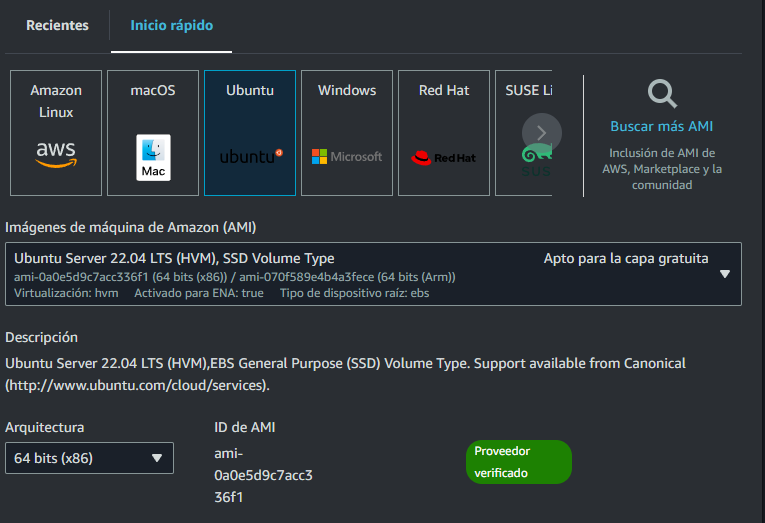

Seleccionar tipo de instancia en t2.medium

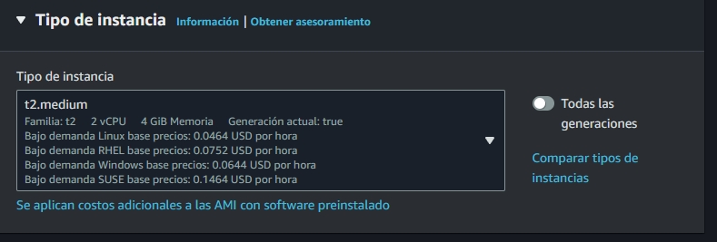

Crear un par de claves y guardarlas ya que seran necesarias para conectarse mediante ssh

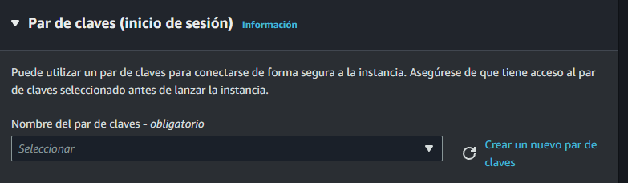

Habilitar las configuraciones de red para permitir el trafico de HTTP y HTTPS

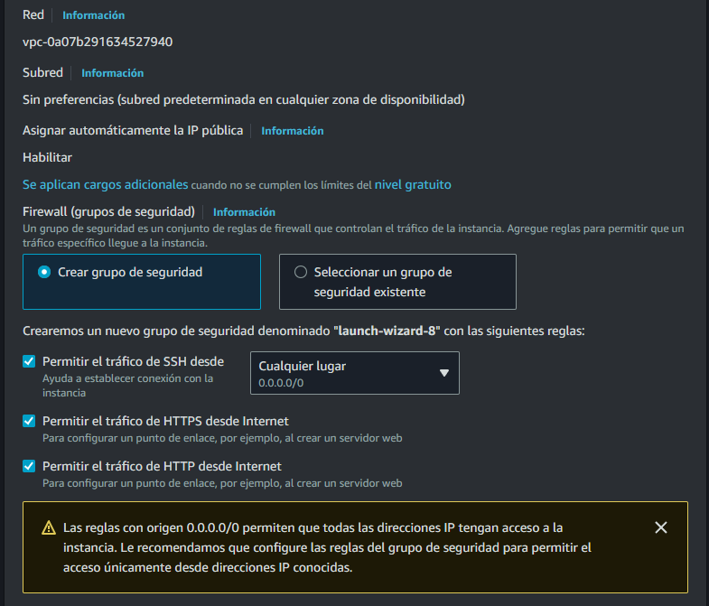

Lanzar la instancia 

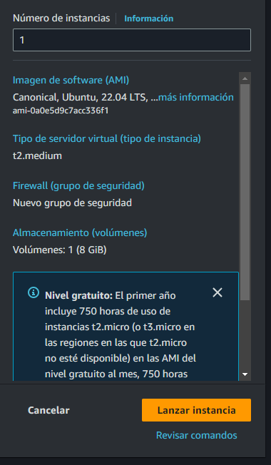

## Configurar nueva regla de entrada

Dirigirse a Instancias y seleccionar la que hayamos creado y dirigirnos a seguridad y seleccionar grupos de seguridad

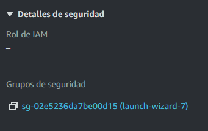

Editar regla de entrada y crear una nueva regla de entrada

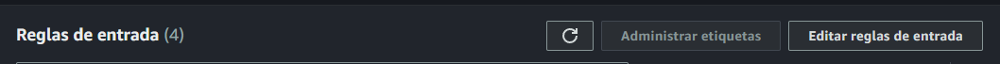

Configurar la regla con TCP y puerto 8080 para permitir acceder a jenkins y guardar los cambios

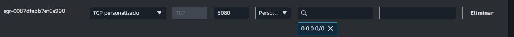


## Conectarse mediante SSH

Regresamos a la instancia y seleccionamos conectar

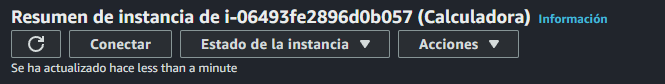

Nos conectamos utilizando el ejemplo que nos da, solo intercambiamos la parte de la llave con la ruta donde se encuentra la llave

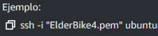

## Instalar jenkins en AWS EC2


### Actualizar paquetes
```bash
sudo apt-get update
```

### Instalar JAVA JDK 17

```bash
sudo apt install openjdk-17-jre-headless
```

### Instalar jenkins 

```bash
sudo wget -O /usr/share/keyrings/jenkins-keyring.asc \
  https://pkg.jenkins.io/debian-stable/jenkins.io-2023.key
echo "deb [signed-by=/usr/share/keyrings/jenkins-keyring.asc]" \
  https://pkg.jenkins.io/debian-stable binary/ | sudo tee \
  /etc/apt/sources.list.d/jenkins.list > /dev/null
sudo apt-get update
sudo apt-get install jenkins
```
### Visualizar el estado de jenkins
```sh
sudo systemctl status jenkins
```

Si jenkins no esta iniciado podemos iniciarlo con
```sh
sudo systemctl start jenkins
```

### Recuperar la contraseña inicial de jenkins
Con este comando recuperaremos la contraseña inicial de jenkins para configurarlo
```sh
sudo cat /var/lib/jenkins/secrets/initialAdminPassword
```
Configurar jenkins por default 

### Actualizar dependencias
```bash
sudo apt update
sudo apt upgrade
```
## Instalar docker AWS EC2
### Instalar paquetes necesarios para docker
```sh
sudo apt install apt-transport-https ca-certificates curl software-properties-common
```

### Instalación de docker 

```bash

curl -fsSL https://download.docker.com/linux/ubuntu/gpg | sudo gpg --dearmor -o /usr/share/keyrings/docker-archive-keyring.gpg

echo "deb [arch=$(dpkg --print-architecture) signed-by=/usr/share/keyrings/docker-archive-keyring.gpg] https://download.docker.com/linux/ubuntu $(lsb_release -cs) stable" | sudo tee /etc/apt/sources.list.d/docker.list > /dev/null

sudo apt update

sudo apt install docker-ce


```
### visualizar si docker se ha instalado 

```sh
sudo docker --version
```


### Establecer docker para que se inicie al arrancar el sistema
```sh
sudo systemctl enable docker
```

### Inicar docker si no esta iniciado
```sh
sudo systemctl start docker
```
## Instalacion de Pip y Pipenv

### Instalar pip
```sh
sudo apt install python3-pip
```

### Instalar pipenv
```sh
sudo pip install pipenv
```

## Permisos de jenkins

### Darle permisos a jenkins sobre docker
```sh
sudo chmod 666 /var/run/docker.sock
sudo usermod -aG docker jenkins
```

### Reiniciar docker para que los cambios surtan efecto
```sh
sudo systemctl restart docker
```

### Ejecutar `sudo visudo` y añadir el siguiente texto, para poder utilizar sudo en jenkins
```
jenkins ALL=(ALL) NOPASSWD: ALL
```
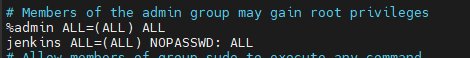

### Reiniciar jenkins para actualizar los cambios
```sh
sudo systemctl restart jenkins
```


## Instalación de chrome y chromedriver

### Instalar Chrome
```sh
wget https://dl.google.com/linux/direct/google-chrome-stable_current_amd64.deb
sudo apt install ./google-chrome-stable_current_amd64.deb
google-chrome --version
```

### Instalar el Chromedriver
```sh
wget https://storage.googleapis.com/chrome-for-testing-public/128.0.6613.84/linux64/chromedriver-linux64.zip
unzip chromedriver-linux64.zip
sudo mv chromedriver-linux64/chromedriver /usr/local/bin/
sudo chmod +x /usr/local/bin/chromedriver

```
## Configuraciones adicionales

### Crear un token clasico en github y darle los permisos de repo, agregar este token a las credenciales globales de jenkins con el id `github-token`

### Para esto entramos a GitHub -> Settings -> Personal access token -> Token classic

Generamos el token classic al menos con los permisos de `repo` es necesario guardarlo porque cuando se recargue la página ya no se podra visualizar nuevamente

### Agregamos este token a jenkins, para eso nos dirigimos a jenkins -> Administrar jenkins -> Credentials y seleccionamos dominio global y agregamos una nueva credencial

Username ponemos nuestro usuario de GitHub, en passsword el token que acabamos de generar y el id podemos cambiarlo pero para este ejemplo es `github-token`

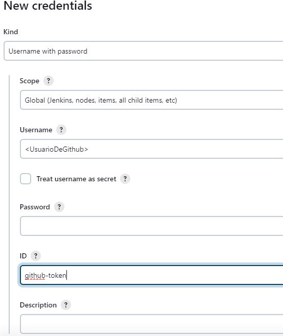

## Webhook

### Para configurar el webhook nos dirigimos a nuestro repositorio -> settings -> Webhooks y agregamos uno nuevo y marcamos que solo sera para eventos de push (Para este ejemplo desactivamos SSL)

### Configurar Webhook en github con la url de jenkins agregando `/github-webhook/` y configurando el `content-type` en `application/json`

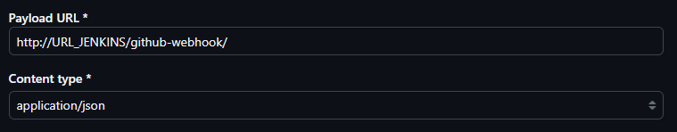

### Recargamos la pagina de WebHook y deberia tener una palomita 

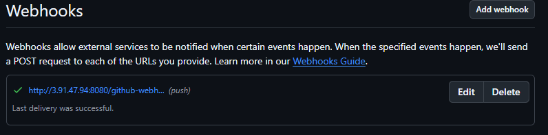

## Ejecución

### Agregamos una nueva tarea en jenkins de tipo pipeline y seleccionamos 

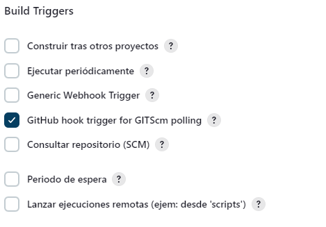

### Seleccionamos Pipeline from SCM y Git, configuramos el repositorio y en credenciales no agregamos ninguna, cambiar rama `master` o `main` dependiendo del repo, por último en Script Path poner `Jenkinsfile`

### La prueba deberia ejecutarse automaticamente cuando se haga un push en el repositorio